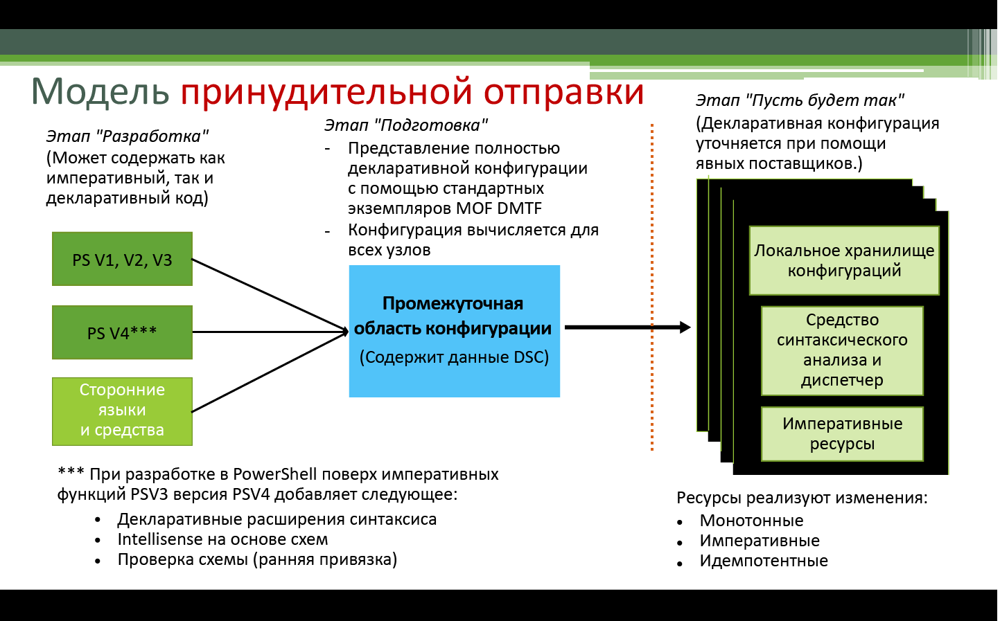
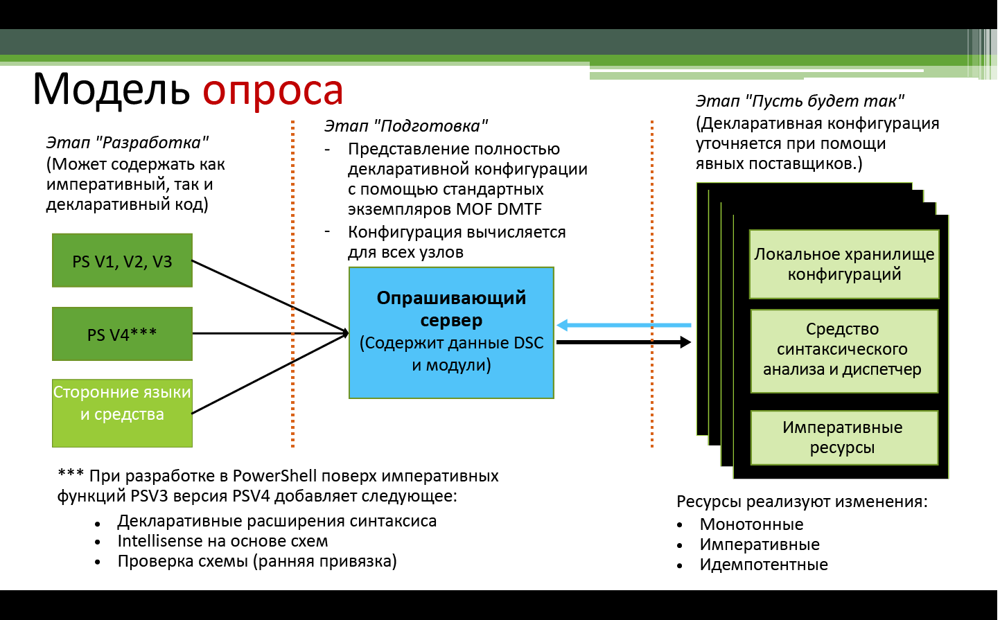

# Применение конфигураций

>Область применения: Windows PowerShell 4.0, Windows PowerShell 5.0

Настройку требуемого состояния PowerShell (DSC) можно применять двумя способами: в режиме принудительной отправки и в режиме опроса.

## Режим принудительной отправки

Режим принудительной отправки означает, что пользователь активно применяет конфигурацию к целевому узлу, вызывая командлет [Start-DscConfiguration](https://technet.microsoft.com/en-us/library/dn521623.aspx).

Созданную и скомпилированную конфигурацию можно применить в режиме принудительной отправки, вызвав командлет [Start-DscConfiguration](https://technet.microsoft.com/en-us/library/dn521623.aspx) и указав в качестве значения параметра -Path для этого командлета путь к MOF-файлу конфигурации. Например, если MOF-файл конфигурации находится по адресу `C:\DSC\Configurations\localhost.mof`, его можно применить на локальном компьютере с помощью следующей команды:
`Start-DscConfiguration -Path 'C:\DSC\Configurations'`

> __Примечание__. По умолчанию DSC выполняет конфигурацию в фоновом режиме. Для интерактивного выполнения конфигурации вызовите командлет [Start-DscConfiguration](https://technet.microsoft.com/en-us/library/dn521623.aspx) с параметром __-wait__.

Модули облачного развертывания обычно используют режим опроса в рамках более широкого решения.  Например, Microsoft Azure предлагает [расширение DSC](https://azure.microsoft.com/en-us/documentation/articles/virtual-machines-extensions-features/) для виртуальных машин.  Оно позволяет включить сценарий конфигурации и все необходимые модули DSC в файл архива, который распаковывается и запускается на виртуальной машине в ходе развертывания.  

## Режим опроса

В режиме опроса на опрашивающих клиентах настраивается получение конфигураций требуемого состояния с удаленного опрашивающего сервера. На опрашивающем сервере при этом настраивается размещение службы DSC и производится подготовка с использованием конфигураций и ресурсов, которые требуются опрашивающим клиентам.
На каждом опрашивающем сервере задается расписание задачи периодической проверки соответствия для конфигурации узла. При первой активации события на опрашивающем клиенте вызывается локальный диспетчер конфигураций (LCM) для проверки конфигурации. Если опрашивающий клиент настроен правильно, ничего не происходит. В противном случае LCM передает на опрашивающий сервер запрос для получения заданной конфигурации. Если такая конфигурация на опрашивающем сервере есть и проходит начальные проверки допустимости, она передается на опрашивающий клиент, где LCM ее выполняет.

Дополнительные сведения о локальном развертывании опрашивающего сервера DSC см. в руководстве по настройке и планированию опрашивающего сервера DSC.

Если вы предпочитаете использовать для размещения опрашивающего сервера веб-службу, обратитесь к [службе автоматизации Azure DSC](https://azure.microsoft.com/en-us/documentation/articles/automation-dsc-overview/).

В следующих разделах показано, как настраивать опрашивающие серверы и клиенты:

- [Настройка опрашивающего веб-сервера](pullServer.md)
- [Настройка опрашивающего SMB-сервера](pullServerSMB.md)
- [Настройка опрашивающего клиента](pullClientConfigID.md)<!--HONumber=Feb16_HO4-->
