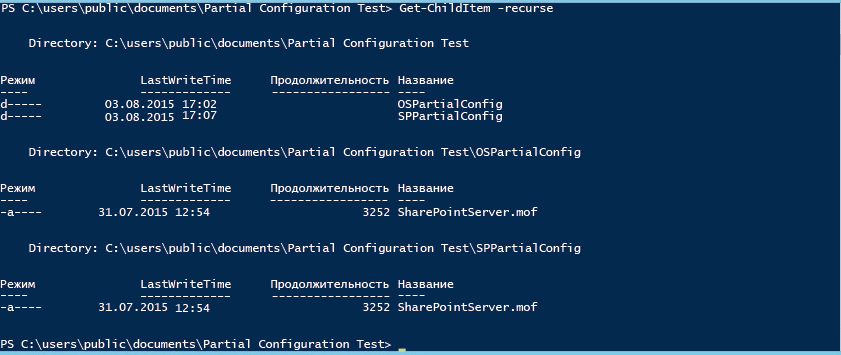

# <a name="powershell-desired-state-configuration-partial-configurations"></a>Частичные конфигурации службы настройки требуемого состояния PowerShell

>Область применения: Windows PowerShell 5.0

В PowerShell 5.0 служба настройки требуемого состояния (DSC) разрешает доставлять конфигурации фрагментами и из нескольких источников. Локальный диспетчер конфигураций (LCM) на целевом узле объединяет фрагменты перед тем, как применить их в качестве единой конфигурации. Эта возможность позволяет разделять конфигурацию между командами или отдельными пользователями. Например, если несколько команд разработчиков совместно работают над службой, возможно, каждая из них хочет создать конфигурацию для управления своей частью службы. Каждую из этих конфигураций можно извлекать с разных опрашивающих серверов и добавлять на разных этапах разработки. Частичные конфигурации позволяют разным пользователям или командам контролировать различные аспекты настройки узлов без координации изменений в едином документе конфигурации. Например, одна команда может отвечать за развертывание виртуальной машины и операционной системы, тогда как другая — развертывать другие приложения и службы в этой виртуальной машине. С частичными конфигурациями каждая команда может создать собственную конфигурацию без излишних сложностей.

Вы можете использовать частичные конфигурации в режиме принудительной отправки, в режиме запроса или в сочетании.

## <a name="partial-configurations-in-push-mode"></a>Частичные конфигурации в режиме принудительной отправки
Чтобы использовать частичные конфигурации в режиме принудительной отправки, настройте LCM на целевом узле для получения частичных конфигураций. Каждая частичная конфигурация должна принудительно отправляться на целевой узел с использованием командлета Publish-DSCConfiguration. Затем целевой узел добавляет частичную конфигурацию в единую. Применить конфигурацию можно, вызвав командлет [Start-DscConfiguration](https://technet.microsoft.com/en-us/library/dn521623.aspx).

### <a name="configuring-the-lcm-for-push-mode-partial-configurations"></a>Настройка LCM для частичных конфигураций в режиме принудительной отправки
Чтобы настроить LCM для частичных конфигураций в режиме принудительной отправки, создайте конфигурацию **DSCLocalConfigurationManager** с одним блоком **PartialConfiguration** для каждой частичной конфигурации. Дополнительные сведения о настройке LCM см. в разделе [Настройка локального диспетчера конфигураций в Windows](https://technet.microsoft.com/en-us/library/mt421188.aspx). В следующем примере показана конфигурация LCM, в которой ожидаются две частичные конфигурации: та, которая развертывает ОС, и та, которая развертывает и настраивает SharePoint.

```powershell
[DSCLocalConfigurationManager()]
configuration PartialConfigDemo
{
    Node localhost
    {
        
           PartialConfiguration ServiceAccountConfig
        {
            Description = 'Configuration to add the SharePoint service account to the Administrators group.'
            RefreshMode = 'Push'
        }
           PartialConfiguration SharePointConfig
        {
            Description = 'Configuration for the SharePoint server'
            RefreshMode = 'Push'
        }
    }
}
PartialConfigDemo 
```

**RefreshMode** для каждой частичной конфигурации имеет значение Push. Имена блоков **PartialConfiguration** (в этом случае ServiceAccountConfig и SharePointConfig) должны точно совпадать с именами конфигураций, отправляемых на целевой узел.

### <a name="publishing-and-starting-push-mode-partial-configurations"></a>Публикация и запуск частичных конфигураций в режиме принудительной отправки


Затем вызовите **Publish-DSCConfiguration** для каждой конфигурации, передав папки, которые содержат документы конфигурации, в качестве параметров Path. После публикации обеих конфигураций вы можете вызвать `Start-DSCConfiguration –UseExisting` на целевом узле.

## <a name="partial-configurations-in-pull-mode"></a>Частичные конфигурации в режиме запросов

Частичные конфигурации можно запросить из одного или нескольких опрашивающих серверов (дополнительные сведения об опрашивающих серверах см. в разделе [Опрашивающие сервера настройки требуемого состояния Windows PowerShell](pullServer.md). Для этого необходимо настроить в LCM на целевом узле извлечение частичных конфигураций, а также назвать документы конфигурации и указать их расположение на опрашивающих серверах.

### <a name="configuring-the-lcm-for-pull-node-configurations"></a>Настройка LCM для конфигураций опрашивающего узла

Чтобы настроить в LCM опрос частичных конфигураций с опрашивающего сервера, определите опрашивающий сервер в блоке **ConfigurationRepositoryWeb** (для опрашивающего HTTP-сервера) или **ConfigurationRepositoryShare** (для опрашивающего SMB-сервера). Затем создайте блоки **PartialConfiguration**, которые ссылаются на опрашивающий сервер, используя свойство **ConfigurationSource**. Кроме того, вам потребуется создать блок **параметров**, чтобы указать, что LCM использует режим запросов, и задать **ConfigurationNames** или **ConfigurationID** для опрашивающего сервера и целевого узла в целях определения конфигураций. В следующей метаконфигурации задан опрашивающий HTTP-сервер с именем CONTOSO-PullSrv и две частичные конфигурации, использующие этот опрашивающий сервер.

Дополнительные сведения о настройке LCM с использованием **ConfigurationNames** см. в разделе [Настройка опрашивающего клиента с помощью имен конфигурации](pullClientConfigNames.md). Дополнительные сведения о настройке LCM с использованием **ConfigurationID** см. в разделе [Настройка опрашивающего клиента с помощью идентификатора конфигурации](pullClientConfigID.md).

#### <a name="configuring-the-lcm-for-pull-mode-configurations-using-configuration-names"></a>Настройка LCM для конфигураций режима запросов с использованием имен конфигурации

```powershell
[DscLocalConfigurationManager()]
Configuration PartialConfigDemoConfigNames
{
        Settings
        {
            RefreshFrequencyMins            = 30;
            RefreshMode                     = "PULL";
            ConfigurationMode               ="ApplyAndAutocorrect";
            AllowModuleOverwrite            = $true;
            RebootNodeIfNeeded              = $true;
            ConfigurationModeFrequencyMins  = 60;
        }
        ConfigurationRepositoryWeb CONTOSO-PullSrv
        {
            ServerURL                       = 'https://CONTOSO-PullSrv:8080/PSDSCPullServer.svc'    
            RegistrationKey                 = 5b41f4e6-5e6d-45f5-8102-f2227468ef38     
            ConfigurationNames              = @("ServiceAccountConfig", "SharePointConfig")
        }     
        
        PartialConfiguration ServiceAccountConfig 
        {
            Description                     = "ServiceAccountConfig"
            ConfigurationSource             = @("[ConfigurationRepositoryWeb]CONTOSO-PullSrv") 
        }
 
        PartialConfiguration SharePointConfig
        {
            Description                     = "SharePointConfig"
            ConfigurationSource             = @("[ConfigurationRepositoryWeb]CONTOSO-PullSrv")
            DependsOn                       = '[PartialConfiguration]ServiceAccountConfig'
        }
   
}
``` 

#### <a name="configuring-the-lcm-for-pull-mode-configurations-using-configurationid"></a>Настройка LCM для конфигураций режима запросов с использованием ConfigurationID

```powershell
[DSCLocalConfigurationManager()]
configuration PartialConfigDemoConfigID
{
    Node localhost
    {
        Settings
        {
            RefreshMode                     = 'Pull'
            ConfigurationID                 = '1d545e3b-60c3-47a0-bf65-5afc05182fd0'
            RefreshFrequencyMins            = 30 
            RebootNodeIfNeeded              = $true
        }
        ConfigurationRepositoryWeb CONTOSO-PullSrv
        {
            ServerURL                       = 'https://CONTOSO-PullSrv:8080/PSDSCPullServer.svc'
            
        }
        
           PartialConfiguration ServiceAccountConfig
        {
            Description                     = 'Configuration for the Base OS'
            ConfigurationSource             = '[ConfigurationRepositoryWeb]CONTOSO-PullSrv'
            RefreshMode                     = 'Pull'
        }
           PartialConfiguration SharePointConfig
        {
            Description                     = 'Configuration for the Sharepoint Server'
            ConfigurationSource             = '[ConfigurationRepositoryWeb]CONTOSO-PullSrv'
            DependsOn                       = '[PartialConfiguration]ServiceAccountConfig'
            RefreshMode                     = 'Pull'
        }
    }
}
PartialConfigDemo 
```

Вы можете извлечь частичные конфигурации более чем из одного опрашивающего сервера — потребуется только определить каждый опрашивающий сервер, а затем сослаться на соответствующий опрашивающий сервер в каждом блоке **PartialConfiguration**.

После создания метаконфигурации необходимо запустить ее для создания документа конфигурации (MOF-файла), а затем вызвать [Set-DscLocalConfigurationManager](https://technet.microsoft.com/en-us/library/dn521621(v=wps.630).aspx) для настройки LCM.

### <a name="naming-and-placing-the-configuration-documents-on-the-pull-server-configurationnames"></a>Именование и размещение документов конфигурации на опрашивающем сервере (ConfigurationNames)

Документы частичной конфигурации необходимо разместить в папке, указанной как **ConfigurationPath**, в файле `web.config` для опрашивающего сервера (обычно `C:\Program Files\WindowsPowerShell\DscService\Configuration`). Документы конфигурации должны быть именованы следующим образом: `ConfigurationName.mof`, где _ConfigurationName_ — имя частичной конфигурации. Например, документы конфигурации следует назвать следующим образом.

```
ServiceAccountConfig.mof
ServiceAccountConfig.mof.checksum
SharePointConfig.mof
SharePointConfig.mof.checksum
```

### <a name="naming-and-placing-the-configuration-documents-on-the-pull-server-configurationid"></a>Именование и размещение документов конфигурации на опрашивающем сервере (ConfigurationID)

Документы частичной конфигурации необходимо разместить в папке, указанной как **ConfigurationPath**, в файле `web.config` для опрашивающего сервера (обычно `C:\Program Files\WindowsPowerShell\DscService\Configuration`). Документы конфигурации необходимо именовать следующим образом: _ConfigurationName_. _ConfigurationID_`.mof`, где _ConfigurationName_ будет именем частичной конфигурации, а _ConfigurationID_ — идентификатором конфигурации, заданным в LCM на целевом узле. Например, документы конфигурации следует назвать следующим образом.

```
ServiceAccountConfig.1d545e3b-60c3-47a0-bf65-5afc05182fd0.mof
ServiceAccountConfig.1d545e3b-60c3-47a0-bf65-5afc05182fd0.mof.checksum
SharePointConfig.1d545e3b-60c3-47a0-bf65-5afc05182fd0.mof
SharePointConfig.1d545e3b-60c3-47a0-bf65-5afc05182fd0.mof.checksum
```


### <a name="running-partial-configurations-from-a-pull-server"></a>Запуск частичных конфигураций с опрашивающего сервера

После настройки LCM на целевом узле, а также создания и именования документов на опрашивающем сервере целевой узел запросит частичные конфигурации, объединит их и будет применять результирующую конфигурацию с регулярными интервалами, указанными свойством **RefreshFrequencyMins** в LCM. Если вы хотите принудительно применить обновление, можно вызвать командлет [Update-DscConfiguration](https://technet.microsoft.com/en-us/library/mt143541.aspx) для извлечения конфигураций, а затем `Start-DSCConfiguration –UseExisting` для их применения.


## <a name="partial-configurations-in-mixed-push-and-pull-modes"></a>Частичные конфигурации в смешанных режимах принудительной отправки и запросов

Кроме того, вы можете совместить режимы принудительной отправки и запросов для частичных конфигураций Это значит, что у вас может быть одна частичная конфигурация, запрашиваемая с опрашивающего сервера, тогда как для другой частичной конфигурации выполняется принудительная отправка. Используйте каждую частичную конфигурацию в соответствии с ее режимом обновления. Например, в следующей метаконфигурации описывается тот же пример с частичной конфигурацией учетной записи службы в режиме запросов и частичной конфигурации SharePoint в режиме принудительной отправки.

### <a name="mixed-push-and-pull-modes-using-configurationnames"></a>Смешанные режимы принудительной отправки и запросов с использованием ConfigurationNames

```powershell
[DscLocalConfigurationManager()]
Configuration PartialConfigDemoConfigNames
{
        Settings
        {
            RefreshFrequencyMins            = 30;
            RefreshMode                     = "PULL";
            ConfigurationMode               = "ApplyAndAutocorrect";
            AllowModuleOverwrite            = $true;
            RebootNodeIfNeeded              = $true;
            ConfigurationModeFrequencyMins  = 60;
        }
        ConfigurationRepositoryWeb CONTOSO-PullSrv
        {
            ServerURL                       = 'https://CONTOSO-PullSrv:8080/PSDSCPullServer.svc'    
            RegistrationKey                 = 5b41f4e6-5e6d-45f5-8102-f2227468ef38     
            ConfigurationNames              = @("ServiceAccountConfig", "SharePointConfig")
        }     
        
        PartialConfiguration ServiceAccountConfig 
        {
            Description                     = "ServiceAccountConfig"
            ConfigurationSource             = @("[ConfigurationRepositoryWeb]CONTOSO-PullSrv")
            RefreshMode                     = 'Pull' 
        }
 
        PartialConfiguration SharePointConfig
        {
            Description                     = "SharePointConfig"
            DependsOn                       = '[PartialConfiguration]ServiceAccountConfig'
            RefreshMode                     = 'Push'
        }
   
}
``` 

### <a name="mixed-push-and-pull-modes-using-configurationid"></a>Смешанные режимы принудительной отправки и запросов с использованием ConfigurationID

```powershell
[DSCLocalConfigurationManager()]
configuration PartialConfigDemo
{
    Node localhost
    {
        Settings
        {
            RefreshMode             = 'Pull'
            ConfigurationID         = '1d545e3b-60c3-47a0-bf65-5afc05182fd0'
            RefreshFrequencyMins    = 30 
            RebootNodeIfNeeded      = $true
        }
        ConfigurationRepositoryWeb CONTOSO-PullSrv
        {
            ServerURL               = 'https://CONTOSO-PullSrv:8080/PSDSCPullServer.svc'
            
        }
        
           PartialConfiguration ServiceAccountConfig
        {
            Description             = 'Configuration for the Base OS'
            ConfigurationSource     = '[ConfigurationRepositoryWeb]CONTOSO-PullSrv'
            RefreshMode             = 'Pull'
        }
           PartialConfiguration SharePointConfig
        {
            Description             = 'Configuration for the Sharepoint Server'
            DependsOn               = '[PartialConfiguration]ServiceAccountConfig'
            RefreshMode             = 'Push'
        }
    }
}
PartialConfigDemo 
```

Обратите внимание, что режим **RefreshMode**, указанный в блоке Settings (Настройки), — это Pull (Режим запросов), а режим **RefreshMode** для частичной конфигурации SharePointConfig — Push (Принудительная отправка).

MOF-файлы конфигурации следует именовать и располагать в соответствии с их режимами обновления. Вызовите **Publish-DSCConfiguration**, чтобы опубликовать частичную конфигурацию `SharePointConfig`, и дождитесь извлечения конфигурации `ServiceAccountConfig` из опрашивающего сервера или выполните принудительное обновление, вызвав [Update-DscConfiguration](https://technet.microsoft.com/en-us/library/mt143541(v=wps.630).aspx).

## <a name="example-serviceaccountconfig-partial-configuration"></a>Пример частичной конфигурации ServiceAccountConfig

```powershell
Configuration ServiceAccountConfig
{
    Param (
        [Parameter(Mandatory,
                   HelpMessage="Domain credentials required to add domain\sharepoint_svc to the local Administrators group.")]
        [ValidateNotNullOrEmpty()]
        [pscredential]$Credential
    )

    Import-DscResource -ModuleName PSDesiredStateConfiguration


    Node localhost
    {
        Group LocalAdmins
        {
            GroupName           = 'Administrators'
            MembersToInclude    = 'domain\sharepoint_svc',
                                  'admins@example.domain'
            Ensure              = 'Present'
            Credential          = $Credential
            
        }

        WindowsFeature Telnet
        {
            Name                = 'Telnet-Server'
            Ensure              = 'Absent'
        }
    }
}
ServiceAccountConfig

```
## <a name="example-sharepointconfig-partial-configuration"></a>Пример частичной конфигурации SharePointConfig
```powershell
Configuration SharePointConfig
{
    Param (
        [Parameter(Mandatory)]
        [ValidateNotNullOrEmpty()]
        [pscredential]$ProductKey
    )

    Import-DscResource -ModuleName xSharePoint

    Node localhost
    {
        xSPInstall SharePointDefault
        {
            Ensure      = 'Present'
            BinaryDir   = '\\FileServer\Installers\Sharepoint\'
            ProductKey  = $ProductKey
        }
    }
}
SharePointConfig
```
##<a name="see-also"></a>См. также 

**Основные понятия**
[Опрашивающие серверы настройки требуемого состояния Windows PowerShell](pullServer.md) 

[Настройка локального диспетчера конфигураций Windows](https://technet.microsoft.com/en-us/library/mt421188.aspx) 

