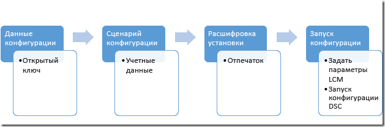

# Защита MOF-файла

>Область применения: Windows PowerShell 4.0, Windows PowerShell 5.0

DSC сообщает целевым узлам об их конфигурации, отправляя каждому узлу MOF-файл с этой информацией. После этого локальный диспетчер конфигураций (LCM) развертывает требуемую конфигурацию на каждом узле. Так как этот файл содержит сведения о конфигурации, его защита очень важна. Для этого можно настроить LCM для проверки учетных данных пользователя. В этом разделе описано, как безопасно передать эти учетные данные на целевой узел путем их шифрования с помощью сертификатов.

>**Примечание.** В этой статье описаны сертификаты, используемые для шифрования. Самозаверяющего сертификата достаточно для шифрования, так как закрытый ключ всегда хранится в тайне, а шифрование не подразумевает доверие документа. Самозаверяющие сертификаты *не* следует использовать для аутентификации. Для этого нужен сертификат из доверенного центра сертификации (ЦС).

## Необходимые компоненты

Чтобы успешно шифровать учетные данные, используемые для защиты конфигурации DSC, вам необходимо следующее:

* **Какие-либо средства выпуска и распространения сертификатов**. В этом разделе и примерах в нем предполагается, что вы используете центр сертификации Active Directory. Дополнительные сведения о службах сертификации Active Directory см. в статьях [Общие сведения о службах сертификации Active Directory](https://technet.microsoft.com/library/hh831740.aspx) и [Службы сертификации Active Directory в Windows Server 2008](https://technet.microsoft.com/windowsserver/dd448615.aspx).
* **Административный доступ к целевому узлу или узлам**.
* **У каждого целевого узла должен быть сертификат с поддержкой шифрования, сохраненный в личном хранилище этого узла**. В Windows PowerShell путь к этому хранилищу будет таким: "Cert:\LocalMachine\My". В примерах в этом разделе используется шаблон "Проверка подлинности рабочей станции", который (вместе с другими шаблонами сертификатов) можно найти в разделе [Шаблоны сертификатов по умолчанию](https://technet.microsoft.com/library/cc740061(v=WS.10).aspx).
* Если вы будете запускать эту конфигурацию не на целевом узле, **экспортируйте открытый ключ сертификата**, а затем импортируйте его на компьютер, на котором будете запускать конфигурацию. Убедитесь, что вы экспортируете только **открытый** ключ; закрытый ключ должен оставаться конфиденциальным.

## Общее описание процесса

 1. Настройте сертификаты, ключи и отпечатки, убедившись, что на каждом целевом узле есть копия сертификата и на компьютере конфигурации есть открытый ключ и отпечаток.
 2. Создайте блок данных конфигурации, содержащий путь и отпечаток для открытого ключа.
 3. Создайте сценарий конфигурации, который определяет нужную конфигурацию целевого узла и настраивает шифрование на целевых узлах, заставляя локальный диспетчер конфигураций расшифровывать данные конфигурации с помощью сертификата и его отпечатка.
 4. Запустите конфигурацию, которая задает параметры локального диспетчера конфигураций и запускает конфигурацию DSC.



## Требования к сертификатам

Для применения шифрования учетных данных на _целевом узле_ должен быть доступен сертификат открытого ключа, который является **доверенным** для компьютера, используемого для создания конфигурации DSC.
Чтобы сертификат открытого ключа можно было использовать для шифрования учетных данных DSC, он должен соответствовать определенным требованиям.
 1. **Использование ключа**:
   - Должен содержать: "KeyEncipherment" и "DataEncipherment".
   - _Не_ должен содержать: "Digital Signature".
 2. **Расширенное использование ключа**:
   - Должен содержать: "Document Encryption" (1.3.6.1.4.1.311.80.1).
   - _Не_ должен содержать: "Client Authentication" (1.3.6.1.5.5.7.3.2) и "Server Authentication" (1.3.6.1.5.5.7.3.1).
 3. Закрытый ключ для сертификата доступен на *целевом узле_.
 4. **Поставщиком** для сертификата должен быть "Microsoft RSA SChannel Cryptographic Provider".
 
>**Рекомендация**. Хотя можно использовать сертификат с ключом типа "Digital Signature" или одним из вариантов расширенного использования ключа для аутентификации, это упростит использование ключа не по назначению и сделает ключ более уязвимым для атаки. Поэтому рекомендуется использовать сертификат, созданный специально для защиты учетных данных DSC. В этом сертификате не применяются указанные типы использования ключа и расширенного использования ключа.
  
Для защиты учетных данных DSC можно использовать любой существующий сертификат на _целевом узле_, удовлетворяющий этим критериям.

## Создание сертификата

Существует два способа создания и использования обязательного сертификата шифрования (пары открытого и закрытого ключей).

1. Создание сертификата на **целевом узле** и экспорт только открытого ключа на **узел разработки**
2. Создание сертификата на **узле разработки** и экспорт всей пары ключей на **целевой узел**

Рекомендуется первый способ, поскольку закрытый ключ, используемый для расшифровки учетных данных в MOF-файле, не покидает целевой узел.


### Создание сертификата на целевом узле

Закрытый ключ следует хранить в тайне, так как он используется для расшифровки MOF-файла на **целевом узле**. Проще всего это сделать, создав сертификат закрытого ключа на **целевом узле** и скопировав **сертификат открытого ключа** на компьютер, используемый для разработки конфигурации DSC в MOF-файле.
В следующем примере
 1. сертификат создается на **целевом узле**;
 2. сертификат открытого ключа экспортируется на **целевой узел**;
 3. сертификат открытого ключа импортируется в хранилище сертификатов **my** на **узле разработки**.

#### На целевом узле: создание и экспорт сертификата
>Узел разработки: Windows Server 2016 и Windows 10

```powershell
# note: These steps need to be performed in an Administrator PowerShell session
$cert = New-SelfSignedCertificate -Type DocumentEncryptionCertLegacyCsp -DnsName 'DscEncryptionCert' -HashAlgorithm SHA256
# export the public key certificate
$cert | Export-Certificate -FilePath "$env:temp\DscPublicKey.cer" -Force
```
После экспорта файл ```DscPublicKey.cer``` потребуется скопировать на **узел разработки**.

>Узел разработки: Windows Server 2012 R2 или Windows 8.1 и более ранних версий

Поскольку командлет New-SelfSignedCertificate в операционных системах Windows, предшествующих Windows 10 и Windows Server 2016, не поддерживает параметр **Type**, для таких операционных систем необходим альтернативный способ создания этого сертификата.
В этом случае можно использовать для создания сертификата программу ```makecert.exe``` или ```certutil.exe```.

Альтернативным способом является [загрузка сценария New-SelfSignedCertificateEx.ps1 из центра сценариев Майкрософт](https://gallery.technet.microsoft.com/scriptcenter/Self-signed-certificate-5920a7c6) и использование этого файла для создания сертификата:
```powershell
# note: These steps need to be performed in an Administrator PowerShell session
# and in the folder that contains New-SelfSignedCertificateEx.ps1
. .\New-SelfSignedCertificateEx.ps1
New-SelfsignedCertificateEx `
    -Subject "CN=${ENV:ComputerName}" `
    -EKU 'Document Encryption' `
    -KeyUsage 'KeyEncipherment, DataEncipherment' `
    -SAN ${ENV:ComputerName} `
    -FriendlyName 'DSC Credential Encryption certificate' `
    -Exportable `
    -StoreLocation 'LocalMachine' `
    -StoreName 'My' `
    -KeyLength 2048 `
    -ProviderName 'Microsoft Enhanced Cryptographic Provider v1.0' `
    -AlgorithmName 'RSA' `
    -SignatureAlgorithm 'SHA256'
# Locate the newly created certificate
$Cert = Get-ChildItem -Path cert:\LocalMachine\My `
    | Where-Object {
        ($_.FriendlyName -eq 'DSC Credential Encryption certificate') `
        -and ($_.Subject -eq "CN=${ENV:ComputerName}")
    } | Select-Object -First 1
# export the public key certificate
$cert | Export-Certificate -FilePath "$env:temp\DscPublicKey.cer" -Force
```
После экспорта файл ```DscPublicKey.cer``` потребуется скопировать на **узел разработки**.

#### На узле разработки: импорт открытого ключа сертификата
```powershell
# Import to the my store
Import-Certificate -FilePath "$env:temp\DscPublicKey.cer" -CertStoreLocation Cert:\LocalMachine\My
```

### Создание сертификата на узле разработки
Кроме того, сертификат шифрования можно создать на **узле разработки**, экспортировать его с **закрытым ключом** в виде PFX-файла, а затем импортировать на **целевой узел**.
Это текущий метод реализации шифрования учетных данных DSC в системе _Nano Server_.
Несмотря на то что PFX-файл защищен паролем, необходимо обеспечить его безопасность во время передачи.
В следующем примере
 1. сертификат создается на **узле разработки**;
 2. сертификат, включая закрытый ключ, экспортируется на **узел разработки**;
 3. закрытый ключ удаляется с **узла разработки**, однако сертификат открытого ключа сохраняется в хранилище **my**;
 4. сертификат открытого ключа импортируется в корневое хранилище сертификатов на **целевом узле разработки**.
   - Его необходимо добавить в корневое хранилище, чтобы **целевой узел** считал его надежным.

#### На узле разработки: создание и экспорт сертификата
>Целевой узел: Windows Server 2016 и Windows 10

```powershell
# note: These steps need to be performed in an Administrator PowerShell session
$cert = New-SelfSignedCertificate -Type DocumentEncryptionCertLegacyCsp -DnsName 'DscEncryptionCert' -HashAlgorithm SHA256
# export the private key certificate
$mypwd = ConvertTo-SecureString -String "YOUR_PFX_PASSWD" -Force -AsPlainText
$cert | Export-PfxCertificate -FilePath "$env:temp\DscPrivateKey.pfx" -Password $mypwd -Force
# remove the private key certificate from the node but keep the public key certificate
$cert | Export-Certificate -FilePath "$env:temp\DscPublicKey.cer" -Force
$cert | Remove-Item -Force
Import-Certificate -FilePath "$env:temp\DscPublicKey.cer" -CertStoreLocation Cert:\LocalMachine\My
```
После экспорта файл ```DscPrivateKey.cer``` потребуется скопировать на **целевой узел**.

>Целевой узел: Windows Server 2012 R2 или Windows 8.1 и более ранних версий

Поскольку командлет New-SelfSignedCertificate в операционных системах Windows, предшествующих Windows 10 и Windows Server 2016, не поддерживает параметр **Type**, для таких операционных систем необходим альтернативный способ создания этого сертификата.
В этом случае можно использовать для создания сертификата программу ```makecert.exe``` или ```certutil.exe```.

Альтернативным способом является [загрузка сценария New-SelfSignedCertificateEx.ps1 из центра сценариев Майкрософт](https://gallery.technet.microsoft.com/scriptcenter/Self-signed-certificate-5920a7c6) и использование этого файла для создания сертификата:
```powershell
# note: These steps need to be performed in an Administrator PowerShell session
# and in the folder that contains New-SelfSignedCertificateEx.ps1
. .\New-SelfSignedCertificateEx.ps1
New-SelfsignedCertificateEx `
    -Subject "CN=${ENV:ComputerName}" `
    -EKU 'Document Encryption' `
    -KeyUsage 'KeyEncipherment, DataEncipherment' `
    -SAN ${ENV:ComputerName} `
    -FriendlyName 'DSC Credential Encryption certificate' `
    -Exportable `
    -StoreLocation 'LocalMachine' `
    -StoreName 'My' `
    -KeyLength 2048 `
    -ProviderName 'Microsoft Enhanced Cryptographic Provider v1.0' `
    -AlgorithmName 'RSA' `
    -SignatureAlgorithm 'SHA256'
# Locate the newly created certificate
$Cert = Get-ChildItem -Path cert:\LocalMachine\My `
    | Where-Object {
        ($_.FriendlyName -eq 'DSC Credential Encryption certificate') `
        -and ($_.Subject -eq "CN=${ENV:ComputerName}")
    } | Select-Object -First 1
# export the public key certificate
$mypwd = ConvertTo-SecureString -String "YOUR_PFX_PASSWD" -Force -AsPlainText
$cert | Export-PfxCertificate -FilePath "$env:temp\DscPrivateKey.pfx" -Password $mypwd -Force
# remove the private key certificate from the node but keep the public key certificate
$cert | Export-Certificate -FilePath "$env:temp\DscPublicKey.cer" -Force
$cert | Remove-Item -Force
Import-Certificate -FilePath "$env:temp\DscPublicKey.cer" -CertStoreLocation Cert:\LocalMachine\My
```

#### На целевом узле: импорт закрытого ключа сертификата в качестве доверенного корневого сертификата
```powershell
# Import to the root store so that it is trusted
$mypwd = ConvertTo-SecureString -String "YOUR_PFX_PASSWD" -Force -AsPlainText
Import-PfxCertificate -FilePath "$env:temp\DscPrivateKey.pfx" -CertStoreLocation Cert:\LocalMachine\Root -Password $mypwd > $null
```

## Данные конфигурации

Блок данных конфигурации определяет, какие целевые узлы использовать, следует ли шифровать учетные данные, какие средства шифрования использовать и т. д. Дополнительные сведения о блоке данных конфигурации см. в разделе [Разделение данных конфигурации и данных среды](configData.md).

Ниже перечислены элементы, связанные с учетными данными шифрования, которые можно настроить для каждого узла:
* **NodeName** — имя целевого узла, для которого настраивается шифрование учетных данных.
* **PsDscAllowPlainTextPassword** — определяет, могут ли незашифрованные учетные данные передаваться на этот узел. Это делать **не рекомендуется**.
* **Thumbprint** — отпечаток сертификата, который будет использоваться для расшифровки учетных данных в конфигурации DSC на _целевом узле_. **Этот сертификат должен существовать в хранилище сертификатов локального компьютера на целевом узле.**
* **CertificateFile** — файл сертификата (содержащий только открытый ключ), который следует использовать для шифрования учетных данных для _целевого узла_. Формат этого файла сертификата — двоичный стандарт X.509 в кодировке DER или Base-64.

В этом примере показан блок данных конфигурации, в котором определен целевой узел для обработки, называемый targetNode, путь к файлу сертификата открытого ключа (с именем targetNode.cer) и отпечаток открытого ключа.

```powershell
$ConfigData= @{ 
    AllNodes = @(     
            @{  
                # The name of the node we are describing 
                NodeName = "targetNode" 

                # The path to the .cer file containing the 
                # public key of the Encryption Certificate 
                # used to encrypt credentials for this node 
                CertificateFile = "C:\publicKeys\targetNode.cer" 

         
                # The thumbprint of the Encryption Certificate 
                # used to decrypt the credentials on target node 
                Thumbprint = "AC23EA3A9E291A75757A556D0B71CBBF8C4F6FD8" 
            }; 
        );    
    }
```


## Сценарий конфигурации

В самом сценарии конфигурации используйте параметр `PsCredential`, чтобы учетные данные хранились в течение минимально возможного срока. При запуске этого примера DSC запросит у вас учетные данные и затем зашифрует MOF-файл с помощью сертификата CertificateFile, который связан с этим целевым узлом в блоке данных конфигурации. В этом коде файл копируется из общей папки, которая защищена для пользователя.

```
configuration CredentialEncryptionExample 
{ 
    param( 
        [Parameter(Mandatory=$true)] 
        [ValidateNotNullorEmpty()] 
        [PsCredential] $credential 
        ) 
    

    Node $AllNodes.NodeName 
    { 
        File exampleFile 
        { 
            SourcePath = "\\Server\share\path\file.ext" 
            DestinationPath = "C:\destinationPath" 
            Credential = $credential 
        } 
    } 
}
```

## Настройка расшифровки

Перед началом работы [`Start-DscConfiguration`](https://technet.microsoft.com/en-us/library/dn521623.aspx) вам необходимо сообщить локальному диспетчеру конфигураций каждого целевого узла, какой сертификат следует использовать для расшифровки учетных данных с помощью ресурса CertificateID для проверки отпечатка сертификата. Этот пример функции найдет соответствующий локальный сертификат (может потребоваться изменить его так, чтобы он нашел именно тот сертификат, который вы хотите использовать):

```powershell
# Get the certificate that works for encryption 
function Get-LocalEncryptionCertificateThumbprint 
{ 
    (dir Cert:\LocalMachine\my) | %{
        # Verify the certificate is for Encryption and valid 
        if ($_.PrivateKey.KeyExchangeAlgorithm -and $_.Verify()) 
        { 
            return $_.Thumbprint 
        } 
    } 
}
```

С сертификатом, который определяется отпечатком, можно обновить сценарий конфигурации, чтобы он использовал это значение:

```powershell
configuration CredentialEncryptionExample 
{ 
    param( 
        [Parameter(Mandatory=$true)] 
        [ValidateNotNullorEmpty()] 
        [PsCredential] $credential 
        ) 
    

    Node $AllNodes.NodeName 
    { 
        File exampleFile 
        { 
            SourcePath = "\\Server\share\path\file.ext" 
            DestinationPath = "C:\destinationPath" 
            Credential = $credential 
        } 
        
        LocalConfigurationManager 
        { 
             CertificateId = $node.Thumbprint 
        } 
    } 
}
```

## Выполнение конфигурации

На этом этапе можно запустить конфигурацию, в результате чего вы получите два выходных файла:

 * Файл *.meta.mof, настраивающий расшифровку учетных данных в локальном диспетчере конфигураций с помощью сертификата, который хранится в хранилище локального компьютера и определяется его отпечатком. [`Set-DscLocalConfigurationManager`](https://technet.microsoft.com/en-us/library/dn521621.aspx) применяет файл *.meta.mof.
 * MOF-файл, который фактически применяет конфигурацию. Командлет Start-DscConfiguration применяет конфигурацию.

Эти команды выполнят следующие действия:

```powershell
Write-Host "Generate DSC Configuration..."
CredentialEncryptionExample -ConfigurationData $ConfigData -OutputPath .\CredentialEncryptionExample

Write-Host "Setting up LCM to decrypt credentials..."
Set-DscLocalConfigurationManager .\CredentialEncryptionExample -Verbose 
 
Write-Host "Starting Configuration..."
Start-DscConfiguration .\CredentialEncryptionExample -wait -Verbose
```

В этом примере конфигурация DSC будет принудительно отправляться на целевой узел.
Конфигурацию DSC также можно применить с помощью опрашивающего сервера DSC, если он доступен.

Дополнительные сведения о применении конфигурации DSC с помощью опрашивающего сервера DSC см. в статье [Setting up a DSC pull client](pullClient.md) (Настройка опрашивающего клиента DSC).

## Пример модуля шифрования учетных данных

Ниже приведен полный пример, включающий все эти действия, а также вспомогательный командлет, который экспортирует и копирует открытые ключи:

```powershell
# A simple example of using credentials
configuration CredentialEncryptionExample
{
    param(
        [Parameter(Mandatory=$true)]
        [ValidateNotNullorEmpty()]
        [PsCredential] $credential
        )
    

    Node $AllNodes.NodeName
    {
        File exampleFile
        {
            SourcePath = "\\server\share\file.txt"
            DestinationPath = "C:\Users\user"
            Credential = $credential
        }
        
        LocalConfigurationManager
        {
            CertificateId = $node.Thumbprint
        }
    }
}

# A Helper to invoke the configuration, with the correct public key 
# To encrypt the configuration credentials
function Start-CredentialEncryptionExample
{
    [CmdletBinding()]
    param ($computerName)


    [string] $thumbprint = Get-EncryptionCertificate -computerName $computerName -Verbose
    Write-Verbose "using cert: $thumbprint"

    $certificatePath = join-path -Path "$env:SystemDrive\$script:publicKeyFolder" -childPath "$computername.EncryptionCertificate.cer"         

    $ConfigData=    @{
        AllNodes = @(     
                        @{  
                            # The name of the node we are describing
                            NodeName = "$computerName"

                            # The path to the .cer file containing the
                            # public key of the Encryption Certificate
                            CertificateFile = "$certificatePath"

                            # The thumbprint of the Encryption Certificate
                            # used to decrypt the credentials
                            Thumbprint = $thumbprint
                        };
                    );    
    }

    Write-Verbose "Generate DSC Configuration..."
    CredentialEncryptionExample -ConfigurationData $ConfigData -OutputPath .\CredentialEncryptionExample `
        -credential (Get-Credential -UserName "$env:USERDOMAIN\$env:USERNAME" -Message "Enter credentials for configuration") 

    Write-Verbose "Setting up LCM to decrypt credentials..."
    Set-DscLocalConfigurationManager .\CredentialEncryptionExample -Verbose 

    Write-Verbose "Starting Configuration..."
    Start-DscConfiguration .\CredentialEncryptionExample -wait -Verbose

}


#region HelperFunctions

# The folder name for the exported public keys
$script:publicKeyFolder = "publicKeys"

# Get the certificate that works for encryptions
function Get-EncryptionCertificate
{
    [CmdletBinding()]
    param ($computerName)
    $returnValue= Invoke-Command -ComputerName $computerName -ScriptBlock {
            $certificates = dir Cert:\LocalMachine\my

            $certificates | %{
                    # Verify the certificate is for Encryption and valid
                    if ($_.PrivateKey.KeyExchangeAlgorithm -and $_.Verify())
                    {
                        # Create the folder to hold the exported public key
                        $folder= Join-Path -Path $env:SystemDrive\ -ChildPath $using:publicKeyFolder
                        if (! (Test-Path $folder))
                        {
                            md $folder | Out-Null
                        }

                        # Export the public key to a well known location
                        $certPath = Export-Certificate -Cert $_ -FilePath (Join-Path -path $folder -childPath "EncryptionCertificate.cer") 

                        # Return the thumbprint, and exported certificate path
                        return @($_.Thumbprint,$certPath);
                    }
                  }
        }
    Write-Verbose "Identified and exported cert..."
    # Copy the exported certificate locally
    $destinationPath = join-path -Path "$env:SystemDrive\$script:publicKeyFolder" -childPath "$computername.EncryptionCertificate.cer"
    Copy-Item -Path (join-path -path \\$computername -childPath $returnValue[1].FullName.Replace(":","$"))  $destinationPath | Out-Null

    # Return the thumbprint
    return $returnValue[0]
}

Start-CredentialEncryptionExample
```


<!--HONumber=Jun16_HO1-->


