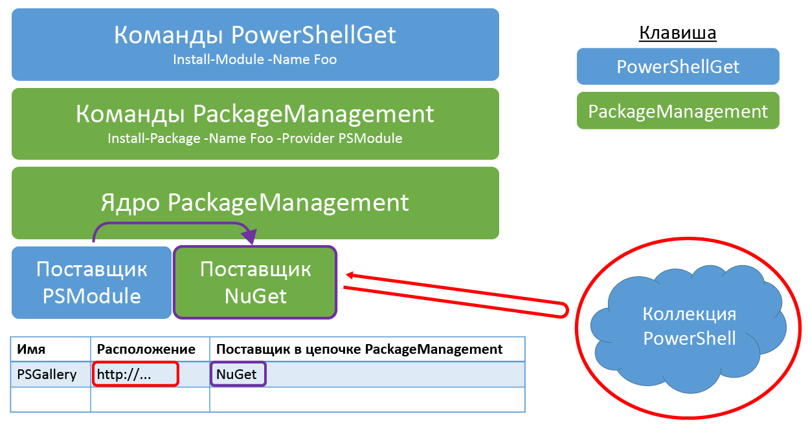

# Вопросы и ответыFrequently Asked Questions

## Что такое модуль PowerShell?What is a PowerShell module?

Модуль PowerShell — это многократно используемый пакет, содержащий некоторые функциональные возможности PowerShell.A PowerShell module is a reusable package containing some PowerShell functionality. Все, что есть в PowerShell, например функции, переменные, ресурсы DSC и т. п., можно упаковать в модули.Everything in PowerShell (functions, variables, DSC resources, etc.) can be packaged in modules. Как правило, модули — это папки, содержащие определенные типы файлов, хранящихся по конкретному пути.Typically, modules are folders containing specific types of files stored on a specific path. Существует несколько разных типов модулей PowerShell.There are a few different types of PowerShell modules out there.

## Что такое сценарий PowerShell?What is a PowerShell script?

Сценарий PowerShell представляет собой ряд команд, сохраненных в PS1-файле для многократного и совместного использования.A PowerShell script is a series of commands that are stored in a .ps1 file to enable reuse and sharing. Рабочие процессы PowerShell тоже являются сценариями PowerShell, которые прописывают набор задач и управляют последовательностью выполнения этих задач.PowerShell workflows are also PowerShell scripts, which outline a set of tasks and provide sequencing for those tasks. Дополнительные сведения см. в руководстве по [началу работы с рабочими процессами PowerShell](https://technet.microsoft.com/en-us/library/jj134242.aspx).For more information, please visit [Getting Started with PowerShell Workflow](https://technet.microsoft.com/en-us/library/jj134242.aspx).

## В чем различия сценариев PowerShell и модулей PowerShell?How are PowerShell Scripts different from PowerShell Modules?

Модули обычно лучше подходят для совместного использования, но мы поощряем совместное использование сценариев и обмен ими, чтобы облегчить вам создание рабочих процессов и сценариев для сообщества.Modules are generally better for sharing, but we are enabling script sharing to make it easier for you to contribute workflows and scripts to the community. Дополнительные сведения см. в следующих блогах.For more information, see the following blogs:

- [Пишите не сценарии, а модули PowerShellDon't Write Scripts, Write PowerShell Modules](https://blogs.technet.microsoft.com/heyscriptingguy/2011/06/27/dont-write-scripts-write-powershell-modules/)
- [Основные сведения о модулях PowerShellUnderstanding PowerShell Modules](https://blogs.technet.microsoft.com/heyscriptingguy/2015/07/10/understanding-powershell-modules/)

## Как осуществляется публикация в коллекции PowerShell?How can I publish to the PowerShell Gallery?

Перед публикацией элементов в коллекции необходимо зарегистрировать учетную запись в коллекции PowerShell, так какYou must register an account in the PowerShell Gallery before you can publish items to the Gallery. для публикации элементов требуется ключ NuGetApiKey, который предоставляется при регистрации.This is because publishing items requires a NuGetApiKey, which is provided upon registration. Чтобы зарегистрироваться, используйте личную, рабочую или учебную учетную запись для входа в коллекцию PowerShell.To register, use your personal, work, or school account to sign in to the PowerShell Gallery. При входе в первый раз необходимо пройти однократный процесс регистрации.A one-time registration process is required when you sign in for the first time. После этого ваш NuGetApiKey будет доступен на странице профиля.Afterwards, your NuGetApiKey is available on your profile page.

После регистрации можно опубликовать свой элемент в коллекции с помощью командлетов [Publish-Module](https://go.microsoft.com/fwlink/?LinkID=760387&clcid=0x409) или [Publish-Script](https://go.microsoft.com/fwlink/?LinkID=760387&clcid=0x409).Once you have registered in the Gallery, use the [Publish-Module](https://go.microsoft.com/fwlink/?LinkID=760387&clcid=0x409) or [Publish-Script](https://go.microsoft.com/fwlink/?LinkID=760387&clcid=0x409) cmdlets to publish your item to the Gallery. Дополнительные сведения о запуске этих командлетов см. на вкладке "Публикация" или в документации по командлетам [Publish-Module](https://go.microsoft.com/fwlink/?LinkID=760387&clcid=0x409) и [Publish-Script](https://go.microsoft.com/fwlink/?LinkID=760387&clcid=0x409).For more details on how to run these cmdlets, visit the Publish tab, or read the [Publish-Module](https://go.microsoft.com/fwlink/?LinkID=760387&clcid=0x409) and [Publish-Script](https://go.microsoft.com/fwlink/?LinkID=760387&clcid=0x409) documentation.

**Для установки или сохранения элементов не требуется регистрироваться в коллекции или входить в нее.****You do not need to register or sign in to the Gallery to install or save items.**

## Получена ошибка "Не удалось обработать запрос.I received "Failed to process request. "Указанный ключ API является недопустимым или не имеет разрешения на доступ к указанному пакету".'The specified API key is invalid or does not have permission to access the specified package.'. Удаленный сервер вернул ошибку: (403) запрещено."The remote server returned an error: (403) Forbidden." при попытке опубликовать элемент в коллекции PowerShell.error when I tried to publish an item to the PowerShell Gallery. Что это значит?What does that mean?

Эта ошибка может возникать по следующим причинам.This error can occur for the following reasons:

- **Указан недопустимый ключ API.**
  **The specified API key is invalid.**
   Проверьте, указан ли правильный ключ API из вашей учетной записи.Ensure that you have specified the valid API key from your account. Чтобы получить ключ API, просмотрите страницу профиля.To get your API key, view your profile page.
- **Элемент с указанным именем вам не принадлежит.**
  **The specified item name is not owned by you.**
   Если вы убедились, что ключ API правильный, то, возможно, элемент с тем же именем, которое вы пытаетесь использовать, уже существует.If you have confirmed that your API key is correct, then there may already exist an item with the same name as the one you are trying to use. Этот элемент мог быть не включен владельцем в список, и в этом случае он будет отсутствовать в любых результатах поиска.The item may have been unlisted by the owner, in which case it will not appear in any search results. Чтобы определить, существует ли уже элемент с таким именем, откройте браузер и перейдите на страницу сведений об этом элементе: `https://www.powershellgallery.com/packages/<itemName>`.To determine if an item with the same name already exists, open a browser and navigate to the item's details page: `https://www.powershellgallery.com/packages/<itemName>`. Например, перейдя непосредственно на страницу `https://www.powershellgallery.com/packages/pester`, вы попадете на страницу сведений о модуле Pester, даже если он не был включен в список.For example, navigating directly to `https://www.powershellgallery.com/packages/pester` will take you to the Pester module's details page, whether it is unlisted or not. Если элемент с конфликтующим именем уже существует и не включен в список, можно предпринять одно из следующих действий.If an item with a conflicting name already exists and is unlisted, you can:
    - Выбрать другое имя для элемента.Select another name for your item.
    - Обратиться к владельцу существующего элемента.Contact the owners of the existing item.

## Почему не получается войти с моей личной учетной записью, но можно было войти вчера?Why can't I sign in with my personal account, but I could sign in yesterday?

Учтите, что ваша учетная запись коллекции не поддерживает изменения основного псевдонима электронной почты.Please be aware that your gallery account does not accommodate changes to your primary email alias. Дополнительные сведения см. в разделе [Псевдонимы электронной почты Майкрософт](https://windows.microsoft.com/en-us/windows/outlook/add-alias-account).For more information, see [Microsoft Email Aliases](https://windows.microsoft.com/en-us/windows/outlook/add-alias-account).

## Почему после установки всех флажков категорий на вкладке "Элементы" я вижу не все элементы коллекции?Why don't I see all the gallery items when I select all the Category checkboxes on the Items tab?

Устанавливая флажок категории, вы заявляете "Хочу видеть все элементы в этой категории".By selecting a Category checkbox, you are stating "I would like to see all items in this category." Будут отображены только элементы в выбранных категориях.Only the items in the selected categories will be displayed. Аналогично, устанавливая флажки для всех категорий, вы заявляете "Хочу видеть все элементы во всех категориях".So similarly, by selecting all the Category checkboxes, you are stating "I would like to see all items in any category." Но некоторые элементы в коллекции не принадлежат ни к одной категории в списке, поэтому они не будут отображаться в результатах.But some items in the gallery do not belong to any of the categories listed, so they will not appear in the results. Для просмотра всех элементов в коллекции снимите флажки всех категорий или снова выберите вкладку "Элементы".To see all items in the gallery, uncheck all the Categories, or select the Items tab again.

## Каковы требования для публикации модуля в коллекции PowerShell?What are the requirements to publish a module to the PowerShell Gallery?

В коллекции можно опубликовать любой вид модуля PowerShell (модули сценариев, двоичные модули или модули манифестов).Any kind of PowerShell module (script modules, binary modules, or manifest modules) can be published to the gallery. Для публикации модуля необходимо сообщить PowerShellGet некоторые сведения об этом модуле: версию, описание, автора и способ лицензирования.To publish a module, PowerShellGet needs to know a few things about it - the version, description, author, and how it is licensed. Эти сведения считываются в процессе публикации из файла *манифеста модуля* (PSD1-файла) или из значения параметра **LicenseUri**командлета [**Publish-Module**](https://go.microsoft.com/fwlink/?LinkID=760387&clcid=0x409).This information is read as part of the publishing process from the *module manifest* (.psd1) file, or from the value of the [**Publish-Module**](https://go.microsoft.com/fwlink/?LinkID=760387&clcid=0x409) cmdlet's **LicenseUri** parameter. Все модули, которые публикуются в коллекции, должны иметь манифесты модуля.All modules published to the Gallery must have module manifests. В коллекции может быть опубликован любой модуль, содержащий в своем манифесте следующие сведения.Any module that includes the following information in its manifest can be published to the Gallery:

- ВерсияVersion
- ОписаниеDescription
- ДизайнерAuthor
- URI для условий лицензии модуля, либо в разделе **PrivateData** манифеста, либо в параметре **LicenseUri** командлета [**Publish-Module**](https://go.microsoft.com/fwlink/?LinkID=760387&clcid=0x409).A URI to the license terms of the module, either as part of the **PrivateData** section of the manifest, or in the **LicenseUri** parameter of the [**Publish-Module**](https://go.microsoft.com/fwlink/?LinkID=760387&clcid=0x409) cmdlet.

## Как создать правильно сформированный манифест модуля?How do I create a correctly-formatted module manifest?

Самый простой способ создать манифест модуля — выполнить командлет [**New-ModuleManifest**](https://go.microsoft.com/fwlink/?LinkID=760387&clcid=0x409).The easiest way to create a module manifest is to run the [**New-ModuleManifest**](https://go.microsoft.com/fwlink/?LinkID=760387&clcid=0x409) cmdlet. В PowerShell 5.0 или более поздней версии командлет New-ModuleManifest создает правильно сформированный манифест модуля с пустыми полями для нужных метаданных, такими как **ProjectUri**, **LicenseUri** и **Tags**.In PowerShell 5.0 or newer, New-ModuleManifest generates a correctly-formatted module manifest with blank fields for useful metadata like **ProjectUri**, **LicenseUri**, and **Tags**. Просто заполните эти пустые поля или используйте этот созданный манифест в качестве примера правильного формата.Simply fill in the blanks, or use the generated manifest as an example of correct formatting.

Чтобы убедиться, что все необходимые поля метаданных заполнены правильно, используйте командлет [**Test-ModuleManifest**](https://go.microsoft.com/fwlink/?LinkID=760387&clcid=0x409).To verify that all required metadata fields have been properly filled, use the [**Test-ModuleManifest**](https://go.microsoft.com/fwlink/?LinkID=760387&clcid=0x409) cmdlet.

Для обновления полей файла манифеста модуля используйте командлет [**Update-ModuleManifest**](https://go.microsoft.com/fwlink/?LinkID=760387&clcid=0x409).To update the module manifest file fields, use the [**Update-ModuleManifest**](https://go.microsoft.com/fwlink/?LinkID=760387&clcid=0x409) cmdlet.

## Каковы требования для публикации сценария в коллекции?What are the requirements to publish a script to the Gallery?

В коллекции можно опубликовать любой вид сценария PowerShell (сценарии или рабочие процессы).Any kind of PowerShell script (scripts or workflows) can be published to the gallery. Для публикации сценария необходимо предоставить PowerShellGet некоторые сведения об этом сценарии: версию, описание, автора и способ лицензирования.To publish a script, PowerShellGet needs to know a few things about it - the version, description, author, and how it is licensed. Эти сведения считываются в рамках процесса публикации из раздела *PSScriptInfo* файла сценария или из значения параметра **LicenseUri**командлета [**Publish-Script**](https://go.microsoft.com/fwlink/?LinkID=760387&clcid=0x409).This information is read as part of the publishing process from the script file's *PSScriptInfo* section, or from the value of the [**Publish-Script**](https://go.microsoft.com/fwlink/?LinkID=760387&clcid=0x409) cmdlet's **LicenseUri** parameter. Все сценарии, которые публикуются в коллекции, должны сопровождаться метаданными.All scripts published to the Gallery must have metadata information. В коллекции может быть опубликован любой сценарий, содержащий в своем разделе PSScriptInfo следующие сведения.Any script that includes the following information in its PSScriptInfo section can be published to the Gallery:

- ВерсияVersion
- ОписаниеDescription
- ДизайнерAuthor
- URI для условий лицензии сценария, либо в разделе **PSScriptInfo** сценария, либо в параметре **LicenseUri** командлета [**Publish-Script**](https://go.microsoft.com/fwlink/?LinkID=760387&clcid=0x409).A URI to the license terms of the script, either as part of the **PSScriptInfo** section of the script, or in the **LicenseUri** parameter of the [**Publish-Script**](https://go.microsoft.com/fwlink/?LinkID=760387&clcid=0x409) cmdlet.

## Как вести поиск?How do I search?

Введите то, что вы ищете, в текстовом поле.Type what you are looking for in the text box. Например, если вы хотите найти модули, которые относятся к SQL Azure, введите azure sql.For example, if you want to find modules that are related to Azure SQL, just type "azure sql". Наша поисковая система будет искать эти ключевые слова во всех опубликованных элементах, включая заголовки, описания и метаданные.Our search engine will look for those keywords in all published items, including titles, descriptions and across metadata. Затем на основании взвешенного балла качества она будет отображать наилучшие соответствия.Then, based on a weighted quality score, it will display the closest matches. Также можно выполнять поиск по определенному полю с помощью синтаксиса field:"value" в запросе поиска для следующих полей.You can also search by specific field using field:"value" syntax in the search query for the following fields:

- ТегиTags
- ФункцииFunctions
- КомандлетыCmdlets
- DscResourcesDscResources
- PowerShellVersionPowerShellVersion

Так, например, при указании в запросе поиска PowerShellVersion:"2.0" будут отображены только результаты, совместимые с PowerShellVersion 2.0 (исходя из соответствующего манифеста модуля или сценария).So, for example, when you search for PowerShellVersion:"2.0" only results that are compatible with PowerShellVersion 2.0 (based on their module/script manifest) will be displayed.

## Как создать правильно сформированный файл сценария?How do I create a correctly-formatted script file?

Самый простой способ создать правильно сформированный файл сценария — выполнить командлет [**New ScriptFileInfo**](https://go.microsoft.com/fwlink/?LinkID=760387&clcid=0x409).The easiest way to create a properly-formatted script file is to run the [**New-ScriptFileInfo**](https://go.microsoft.com/fwlink/?LinkID=760387&clcid=0x409) cmdlet. В PowerShell 5.0 командлет New-ScriptFileInfo создает правильно сформированный файл сценария с пустыми полями для нужных метаданных, такими как **ProjectUri**, **LicenseUri** и **Tags**.In PowerShell 5.0, New-ScriptFileInfo generates a correctly-formatted script file with blank fields for useful metadata like **ProjectUri**, **LicenseUri**, and **Tags**. Просто заполните эти пустые поля или используйте этот созданный файл сценария в качестве примера правильного формата.Simply fill in the blanks, or use the generated script file as an example of correct formatting.

Чтобы убедиться, что все необходимые поля метаданных заполнены правильно, используйте командлет [**Test-ScriptFileInfo**](http://go.microsoft.com/fwlink/?LinkID=760387&clcid=0x409).To verify that all required metadata fields have been properly filled, use the [**Test-ScriptFileInfo**](http://go.microsoft.com/fwlink/?LinkID=760387&clcid=0x409) cmdlet.

Для обновления полей метаданных сценария используйте командлет [**Update-ScriptFileInfo**](https://go.microsoft.com/fwlink/?LinkID=760387&clcid=0x409).To update the script metadata fields, use the [**Update-ScriptFileInfo**](https://go.microsoft.com/fwlink/?LinkID=760387&clcid=0x409) cmdlet.

## Какие существуют другие типы модулей PowerShell?What other types of PowerShell Modules exist?

Термин "модуль PowerShell" также относится к файлам, которые реализуют фактическую функциональность.The term PowerShell module also refers to the files that implement actual functionality. Файлы модулей сценариев (PSM1-файлы) содержат код PowerShell.Script module files (.psm1) contain PowerShell code. Файлы двоичных модулей (DLL-файлы) содержат скомпилированный код.Binary module files (.dll) contain compiled code.

Вот как это можно себе представить: папка, которая содержит модуль, — это папка модуля.Here is one way to think about it: the folder that encapsulates the module is the module folder. Папка модуля может содержать манифест модуля (PSD1-файл), описывающий содержимое папки.The module folder can contain a module manifest (.psd1) that describes the contents of the folder. Файлы, фактически выполняющие работу, — это файлы модулей сценариев (PSM1-файлы) и файлы двоичных модулей (DLL-файлы).The files that actually do the work are the script module files (.psm1) and the binary module files (.dll). Ресурсы DSC расположены в специальной вложенной папке и реализованы в виде файлов модулей сценариев или файлов двоичных модулей.DSC resources are located in a specific sub-folder, and are implemented as script module files or binary module files.

Все модули в коллекции содержат манифесты, и большинство из этих модулей содержат файлы модулей сценариев или файлы двоичных модулей.All of the modules in the Gallery contain module manifests, and most of these modules contain script module files or binary module files. Из-за этих различных значений термин "модуль" может вносить путаницу.The term module can be confusing because of these different meanings. Если явно не указано обратное, все случаи использования слова "модуль" на этой странице относятся к папке модуля, содержащей эти файлы.Unless explicitly stated otherwise, all uses of the word module on this page refer to the module folder containing these files.

## Как соотносятся PackageManagement и PowerShellGet?How does PackageManagement relate to PowerShellGet? (Ответ на высоком уровне)(High Level Answer)

PackageManagement — это общий интерфейс для работы с любым диспетчером пакетов.PackageManagement is a common interface for working with any package manager. В конечном счете, работаете ли вы с модулями PowerShell, MSI-файлами, джемами Ruby, пакетами NuGet или же с модулями Perl, вам нужно будет использовать команды PackageManagement (Find-Package и Install-Package), чтобы найти и установить их.Eventually, whether you're dealing with PowerShell modules, MSIs, Ruby gems, NuGet packages, or Perl modules, you should be able to use PackageManagement's commands (Find-Package and Install-Package) to find and install them. PackageManagement делает это при наличии поставщика пакетов для каждого диспетчера пакетов, который подключается к PackageManagement.PackageManagement does this by having a package provider for each package manager that plugs into PackageManagement. Поставщики выполняют всю фактическую работу; они извлекают содержимое из репозиториев и устанавливают это содержимое локально.Providers do all of the actual work; they fetch content from repositories, and install the content locally. Часто поставщики пакетов просто являются оболочкой существующих инструментов диспетчера пакетов для конкретного типа пакета.Often, package providers simply wrap around the existing package manager tools for a given package type.

PowerShellGet — это диспетчер пакетов для элементов PowerShell.PowerShellGet is the package manager for PowerShell items. Существует поставщик пакетов PSModule, который предоставляет функциональные возможности PowerShellGet через PackageManagement.There is a PSModule package provider that exposes PowerShellGet functionality through PackageManagement. По этой причине для установки модуля из коллекции PowerShell можно выполнить команду [Install-Module](https://go.microsoft.com/fwlink/?LinkID=760387&clcid=0x409) или Install-Package -Provider PSModule.Because of this, you can either run [Install-Module](https://go.microsoft.com/fwlink/?LinkID=760387&clcid=0x409) or Install-Package -Provider PSModule to install a module from the PowerShell Gallery. Некоторые функциональные возможности PowerShellGet, в том числе командлеты [Update-Module](https://go.microsoft.com/fwlink/?LinkID=760387&clcid=0x409) и [Publish-Module](https://go.microsoft.com/fwlink/?LinkID=760387&clcid=0x409), недоступны через команды PackageManagement.Certain PowerShellGet functionality, including [Update-Module](https://go.microsoft.com/fwlink/?LinkID=760387&clcid=0x409) and [Publish-Module](https://go.microsoft.com/fwlink/?LinkID=760387&clcid=0x409), cannot be accessed through PackageManagement commands.

Таким образом, PowerShellGet обеспечивает лишь высококлассные возможности управления пакетами для содержимого PowerShell.In summary, PowerShellGet is solely focused on having a premium package management experience for PowerShell content. PackageManagement предназначен для предоставления всех возможностей управления пакетами через один общий набор инструментов.PackageManagement is focused on exposing all package management experiences through one general set of tools. Если этот ответ вас не удовлетворяет, более подробный ответ можно найти в конце этого документа в разделе **Как фактически соотносятся PackageManagement и PowerShellGet?**.If you find this answer unsatisfying, there is a long answer at the bottom of this document, in the **How does PackageManagement actually relate to PowerShellGet?** section.

Дополнительные сведения см. на [странице проекта PackageManagement](https://oneget.org/).For more information, please visit the [PackageManagement project page](https://oneget.org/).

## Каким образом соотносятся NuGet и PowerShellGet?How does NuGet relate to PowerShellGet?

Коллекция PowerShell является модифицированной версией [коллекции NuGet](https://www.nuget.org/).The PowerShell Gallery is a modified version of the [NuGet Gallery](https://www.nuget.org/). PowerShellGet использует поставщик NuGet для работы с репозиториями на основе NuGet, такими как коллекция PowerShell.PowerShellGet uses NuGet provider to work with NuGet based repositories like the PowerShell Gallery.

PowerShellGet можно использовать с любым допустимым репозиторием NuGet или с общим файловым ресурсом.You can use PowerShellGet against any valid NuGet repository or file share. Нужно просто добавить этот репозиторий, выполнив командлет [**Register-PSRepository**](https://go.microsoft.com/fwlink/?LinkID=760387&clcid=0x409).You simply need to add the repository by running the [**Register-PSRepository**](https://go.microsoft.com/fwlink/?LinkID=760387&clcid=0x409) cmdlet.

## Означает ли это, что для работы с коллекцией можно использовать NuGet.exe?Does that mean I can use NuGet.exe to work with the Gallery?

Да.Yes.

## Как фактически соотносятся PackageManagement и PowerShellGet?How does PackageManagement actually relate to PowerShellGet? (Технические подробности)(Technical Details)

За кулисами PowerShellGet интенсивно использует инфраструктуру PackageManagement.Under the hood, PowerShellGet heavily leverages PackageManagement infrastructure.

На уровне командлетов PowerShell командлет [Install-Module](https://go.microsoft.com/fwlink/?LinkID=760387&clcid=0x409) в действительности является тонкой оболочкой вокруг команды Install-Package -Provider PSModule.At the PowerShell cmdlet layer, [Install-Module](https://go.microsoft.com/fwlink/?LinkID=760387&clcid=0x409) is actually a thin wrapper around Install-Package -Provider PSModule.

На уровне поставщиков пакетов PackageManagement поставщик пакетов PSModule в действительности обращается к другим поставщикам пакетов PackageManagement.At the PackageManagement package provider layer, the PSModule package provider actually calls into other PackageManagement package providers. Например, при работе с коллекциями на основе NuGet (такими как коллекция PowerShell) поставщик пакетов PSModule использует поставщик пакетов NuGet для работы с репозиторием.For example, when you are working with NuGet-based galleries (such as the PowerShell Gallery), the PSModule package provider uses the NuGet Package Provider to work with the repository.

Рис. 1. Архитектура PowerShellGetFigure 1: PowerShellGet Architecture

## Что требуется для запуска PowerShellGet?What is required to run PowerShellGet?

В целом рекомендуется выбрать последнюю версию модуля PowerShellGet (обратите внимание, что для этого требуется .NET 4.5).In general we recommend picking the latest version of PowerShellGet module (note that it requires .NET 4.5).

Для модуля **PowerShellGet** требуется **PowerShell 3.0 или более поздней версии**.The **PowerShellGet** module requires **PowerShell 3.0 or newer**.

Таким образом, для **PowerShellGet** требуется одна из следующих операционных систем:Therefore, **PowerShellGet** requires one of the following operating systems:

- Windows 10Windows 10
- Windows 8.1 ПрофессиональнаяWindows 8.1 Pro
- Windows 8.1 КорпоративнаяWindows 8.1 Enterprise
- Windows 7 с пакетом обновления 1 (SP1)Windows 7 SP1
- Windows Server 2016Windows Server 2016
- Windows Server 2012 R2Windows Server 2012 R2
- Windows Server 2008 R2 с пакетом обновления 1 (SP1)Windows Server 2008 R2 SP1

Для **PowerShellGet** также требуется .NET Framework 4.5 или более поздней версии.**PowerShellGet** also  requires .NET Framework 4.5 or above. Установить .NET Framework 4.5 или более поздней версии можно [отсюда](https://msdn.microsoft.com/en-us/library/5a4x27ek.aspx).You can install .NET Framework 4.5 or above from [here](https://msdn.microsoft.com/en-us/library/5a4x27ek.aspx).

## Можно ли зарезервировать имена для элементов, которые будут опубликованы в будущем?Is it possible to reserve names for items that will be published in future?

Резервировать имена элементов невозможно.It is not possible to squat item names. Если вы считаете, что имя существующего элемента больше подходит для вашего элемента, попробуйте [обратиться к владельцу элемента](psgallery_contacting_item_owners.md).If you feel that an existing item has taken the name which suits your item more, try [contacting the owner of the item](psgallery_contacting_item_owners.md). Если ответ не будет получен в течение нескольких недель, можно обратиться в службу поддержки, и рабочая группа коллекции PowerShell рассмотрит этот вопрос.If you didnt get response within a couple of weeks, you can contact support and the PowerShell Gallery team will look in to it.

## Как запросить право собственности для элементов?How do I claim ownership for items ?

Подробные сведения см. в разделе [Управление владельцами элементов на PowerShellGallery.com](Managing-Item-Owners.md).Check out [Managing Item Owners on PowerShellGallery.com](Managing-Item-Owners.md) for details.

## Что делать с владельцем элемента, который нарушает лицензию на мой элемент?How do I deal with an item owner who is violating my item license?

Мы рекомендуем сообществу PowerShell работать вместе, чтобы разрешать любые споры, возникающие между владельцами одних элементов и владельцами других элементов.We encourage the PowerShell community to work together to resolve any disputes that may arise between item owners and the owners of other items.  Мы разработали [процесс разрешения спорных вопросов](psgallery_dispute_resolution.md) и просим придерживаться этого процесса до подключения администраторов PowerShellGallery.com.We have crafted a [dispute resolution process](psgallery_dispute_resolution.md) that we ask you to follow before PowerShellGallery.com administrators intercede.

