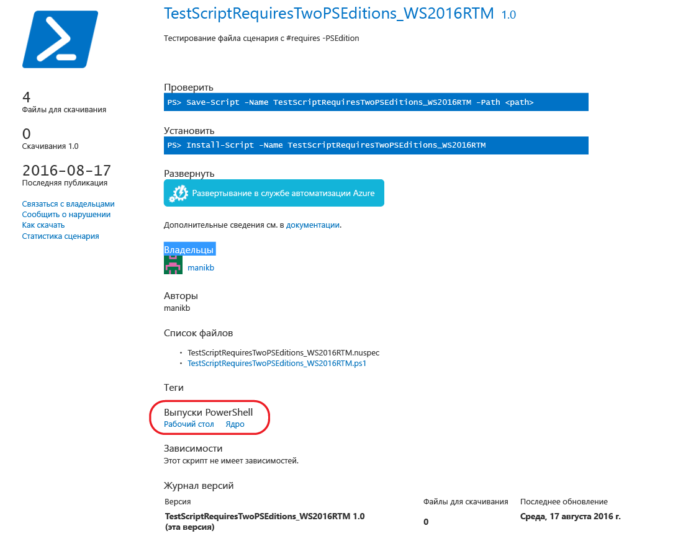
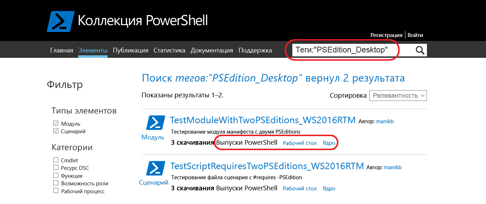
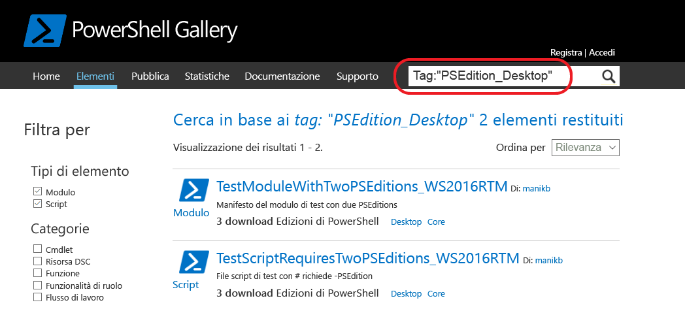

# Элементы с совместимыми выпусками PowerShellItems with compatible PowerShell Editions
Начиная с версии 5.1 доступны различные выпуски среды PowerShell, что означает различные наборы возможностей и совместимость с разными платформами.Starting with version 5.1, PowerShell is available in different editions which denote varying feature sets and platform compatibility.

- **Выпуск Desktop Edition:** построен на основе .NET Framework и обеспечивает совместимость со скриптами и модулями, которые предназначены для версий PowerShell, выполняющихся в полноценных выпусках Windows, таких как Server Core и Windows Desktop.**Desktop Edition:** Built on .NET Framework and provides compatibility with scripts and modules targeting versions of PowerShell running on full footprint editions of Windows such as Server Core and Windows Desktop.
- **Выпуск Core Edition:** построен на основе .NET Core и обеспечивает совместимость со скриптами и модулями, которые предназначены для версий PowerShell, выполняющихся в выпусках Windows с ограниченными возможностями, таких как Nano Server и Windows IoT.**Core Edition:** Built on .NET Core and provides compatibility with scripts and modules targeting versions of PowerShell running on reduced footprint editions of Windows such as Nano Server and Windows IoT.

## Коллекция PowerShell извлекает поддерживаемые метаданные PSEditions и позволяет отфильтровывать элементы, совместимые с конкретными выпусками PowerShellPowerShell Gallery extracts supported PSEditions metadata and allows you to filters the items compatible for specific PowerShell Editions

Если элемент имеет указанные совместимые версии PSEdition, они будут перечислены в разделе "Выпуски PowerShell" на странице отображения элемента, а также в результатах элементов.If an item has compatible PSEditions specified, they will be listed as part of 'PowerShell Editions' in the item display page and also in items results.

## Поиск элементов в коллекции пользовательского интерфейса, работающих в PowerShellCoreSearch for items in the gallery UI which works on PowerShellCore
Для фильтрации элементов в коллекции PowerShell используйте Tags:"PSEdition_Desktop" и Tags:"PSEdition_Core".Use Tags:"PSEdition_Desktop" and Tags:"PSEdition_Core" to filters the items on PowerShell Gallery.

### Для поиска элементов, совместимых с выпуском PowerShell Core, используйте Tags:"PSEdition_Core".Use Tags:"PSEdition_Core" to search items compatible with PowerShell Core Edition.

### Для поиска элементов, совместимых с выпуском PowerShell Desktop, используйте Tags:"PSEdition_Desktop".Use Tags:"PSEdition_Desktop" to search items compatible with PowerShell Desktop Edition.

## Дополнительные сведения о разработке и поиске элементов с совместимыми выпусками PowerShellMore details on authoring and finding the items with compatible PowerShell Editions
### [Модули с PSEditionModules with PSEditions](../psget/module/modulewithpseditionsupport.md)
### [Скрипты с PSEditionScripts with PSEditions](../psget/script/scriptwithpseditionsupport.md)

