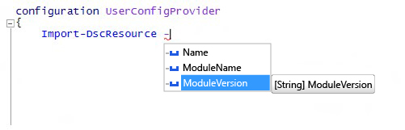

# <a name="import-dscresource-keyword-supports--moduleversion-parameter"></a><span data-ttu-id="25e62-102">Ключевое слово Import-DscResource поддерживает параметр -moduleversion</span><span class="sxs-lookup"><span data-stu-id="25e62-102">Import-DscResource keyword supports -ModuleVersion parameter</span></span>

<span data-ttu-id="25e62-103">Мы добавили в динамическое ключевое слово `Import-DscResource` новый параметр, доступный при создании конфигураций DSC.</span><span class="sxs-lookup"><span data-stu-id="25e62-103">We have added a new parameter to the `Import-DscResource` dynamic keyword available when authoring DSC configurations.</span></span> <span data-ttu-id="25e62-104">Авторы конфигурации теперь могут указать, из какой именно версии модуля следует загружать ресурсы DSC.</span><span class="sxs-lookup"><span data-stu-id="25e62-104">Configuration authors can now specify exactly which module version to load the DSC resources from.</span></span> <span data-ttu-id="25e62-105">Новый синтаксис ключевого слова имеет следующий вид.</span><span class="sxs-lookup"><span data-stu-id="25e62-105">The new syntax of the keyword is:</span></span>

```powershell
Import-DscResource [-Name <ResourceName(s)>] [-ModuleName <ModuleName(s)>] [-ModuleVersion <ModuleVersion>]
```

* <span data-ttu-id="25e62-106">**Name:** имена одного или нескольких импортируемых ресурсов.</span><span class="sxs-lookup"><span data-stu-id="25e62-106">**Name**: Names of one or more resources to import.</span></span>
* <span data-ttu-id="25e62-107">**Имя ModuleName**: имена или объекты ModuleSpecification одного или нескольких импортируемых модулей.</span><span class="sxs-lookup"><span data-stu-id="25e62-107">**ModuleName**: Module names or ModuleSpecification objects of one or more modules to import.</span></span>
* <span data-ttu-id="25e62-108">**ModuleVersion**: версия импортируемого модуля.</span><span class="sxs-lookup"><span data-stu-id="25e62-108">**ModuleVersion**: Version of module ot import.</span></span> <span data-ttu-id="25e62-109">При использовании значение ModuleName должно представлять по имени всего один модуль.</span><span class="sxs-lookup"><span data-stu-id="25e62-109">If used, ModuleName must represent only one module by name.</span></span>

<span data-ttu-id="25e62-110">В интегрированной среде сценариев Windows PowerShell оно отображается с IntelliSense:</span><span class="sxs-lookup"><span data-stu-id="25e62-110">In the Windows PowerShell ISE, it shows up with IntelliSense:</span></span>



<span data-ttu-id="25e62-111">**Примечание**. Параметр `–ModuleVersion` можно использовать только вместе с параметром `–ModuleName`.</span><span class="sxs-lookup"><span data-stu-id="25e62-111">**Note**: the `–ModuleVersion` parameter can only be used in combination with the `–ModuleName` parameter.</span></span> <span data-ttu-id="25e62-112">Его нельзя использовать с именами ресурсов, используя только параметр `–Name`.</span><span class="sxs-lookup"><span data-stu-id="25e62-112">It cannot be used with resource names using only the `–Name` parameter.</span></span>

<span data-ttu-id="25e62-113">До этого единственный способ для указания версии модуля при загрузке ресурсов DSC заключался в использовании объекта спецификации модуля, например `–ModuleName @{ModuleName="UserConfigProvider";ModuleVersion="3.0"}`.</span><span class="sxs-lookup"><span data-stu-id="25e62-113">Before this, the only way to specify the module version when loading DSC resources was by using the Module specification object e.g.: `–ModuleName @{ModuleName="UserConfigProvider";ModuleVersion="3.0"}`</span></span>