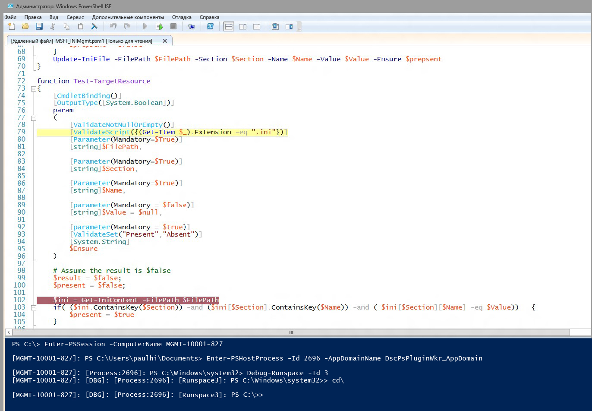

# Отладка сценариев для ресурсов DSC
WMF 5.0 Production Preview обеспечивает поддержку отладки для сценариев ресурсов DSC при их запуске на целевых узлах. В предыдущих версиях WMF 5.0 мы добавляли расширенные функции отладки сценариев с возможностью подключения к локальным процессам (Get-PSHostProcessInfo, Enter-PSHostProcessInfo, Exit-PSHostProcessInfo), перечисления всех пространств выполнения в процессе, а также отладки произвольного пространства выполнения в процессе (Get-Runspace, Debug-Runspace).

Отладка сценариев ресурсов DSC осуществляется с помощью всех этих возможностей, а также двух новых командлетов.

##Синтаксис
**Enable-DscDebug**
Enable-DscDebug \[-BreakAll\] \[-CimSession &lt;CimSession\[\]&gt;\] \[-ThrottleLimit &lt;int&gt;\] \[-AsJob\] \[-WhatIf\] \[-Confirm\] \[&lt;CommonParameters&gt;\]

**Disable-DscDebug**
Disable-DscDebug \[-CimSession &lt;CimSession\[\]&gt;\] \[-ThrottleLimit &lt;int&gt;\] \[-AsJob\] \[-WhatIf\] \[-Confirm\] \[&lt;CommonParameters&gt;\]

##Типичный рабочий процесс


```PowerShell
PS C:\Test> Enable-DscDebug –BreakAll

PS C:\Test> Start-DscConfiguration -path .\TestConfig2 -Wait -Verbose
VERBOSE: Perform operation 'Invoke CimMethod' with following parameters, ''namespaceName' = root/Microsoft/Windows/DesiredStateConfiguration,'className' = MSFT\_DSCLocalConfigurationManager,'methodName' = SendConfigurationApply'.
VERBOSE: An LCM method call arrived from computer MGMT-10001-827 with user sid S-1-5-21-397955417-626881126-188441444-3860663.
VERBOSE: [MGMT-10001-827]: LCM: [ Start Set ]
WARNING: [MGMT-10001-827]: [DSCEngine] Warning LCM is in Debug 'ResourceScriptBreakAll' mode. Resource script processing will be stopped to wait for PowerShell script debugger to attach.
VERBOSE: [MGMT-10001-827]: [DSCEngine] Importing the module C:\WINDOWS\system32\WindowsPowerShell\v1.0\Modules\PSDesiredStateConfiguration\DscResources\MSFT_EnvironmentResource\MSFT_EnvironmentResource.psm1 in force mode.
VERBOSE: [MGMT-10001-827]: LCM: [ Start Resource ] [[Environment]e1]
VERBOSE: [MGMT-10001-827]: LCM: [ Start Test ] [[Environment]e1]
VERBOSE: [MGMT-10001-827]: [[Environment]e1] Importing the module MSFT_EnvironmentResource in force mode.
WARNING: [MGMT-10001-827]: [[Environment]e1] Resource is waiting for PowerShell script debugger to attach. Use the following commands to begin debugging this resource script:
Enter-PSSession -ComputerName MGMT-10001-827 -Credential <credentials>
Enter-PSHostProcess -Id 2640 -AppDomainName DscPsPluginWkr_AppDomain
Debug-Runspace -Id 3

PS C:\Test> Disable-DscDebug
```
А теперь давайте рассмотрим каждую из этих команд и их функции:

**Enable-DscDebug –BreakAll**
Командлет Enable-DscDebug с параметром BreakAll настраивает LCM DSC на запуск сценариев Get-TargetResource, Set-TargetResource, and Test-TargetResource в режиме "Прервать все". Это означает, что сценарий останавливается на первом операторе сценария и ожидает подключения отладчика. Затем можно соединиться с целевым компьютером с помощью удаленного взаимодействия Windows PowerShell и подключить отладчик Windows PowerShell к пространству выполнения и процессу LCM для отладки сценария. После этого можно задать точки останова и выполнить отладку сценария обычным для Windows PowerShell образом.

**Start-DscConfiguration -path .\TestConfig2 -Wait -Verbose**

Эта команда запускает DSC, но поскольку на целевом узле включен режим отладки, он останавливается на первом ресурсе DSC, выполняемом LCM.

Чтобы начать сеанс отладки, выполните команды, показанные в предупреждении после выполнения Start-DscConfiguration. Так вы подключите клиентский отладчик сценариев Windows PowerShell к нужному компьютеру, процессу, домену приложения и пространству выполнения.

* Выполните следующую команду, чтобы при необходимости использовать удаленное взаимодействие Windows PowerShell для подключения к конечному компьютеру. Пропустите эту процедуру, если уже есть подключение к удаленному рабочему столу.
```PowerShell
Enter-PSSession -ComputerName MGMT-10001-827
```
* Эта команда выполняет подключение к хост-процессу LCM DSC и домену приложения, где выполняется сценарий ресурсов.
```PowerShell
Enter-PSHostProcess -Id 2640 -AppDomainName DscPsPluginWkr\_AppDomain
```
*  Эта последняя команда позволяет выполнить отладку пространства выполнения сценария DSC.
```PowerShell
Debug-Runspace -Id 3
```


После того как отладчик подключен, установите точки останова для строк там, где хотите изучить выполнение сценария, а также запустите команду отладчика **continue**, чтобы позволить сценарию выполняться в отладчике. После завершения отладки можно остановить выполнение сценария, введя команду **quit**, или разрешить дальнейшее выполнение без отладчика, выполнив команду **detach**.

Обратите внимание, что в отладчике останавливаются ***все*** сценарии ресурсов. Это означает, что сценарии Test-TargetResoruce, Set-TargetResource и Get-TargetResource по очереди останавливаются в отладчике. Если отладка сценария ресурса не требуется, можно выйти из режима отладки в пространстве выполнения, запустив следующую команду:

Disable-RunspaceDebug -RunspaceId 3

Или можно подключить отладчик, запустив Debug-Runspace и затем сразу же выполнив команду **detach**.

После завершения отладки сценария ресурса следует остановить конфигурацию DSC, выполнив следующую команду:

Stop-DscConfiguration –Force

Наконец, необходимо перенастроить LCM целевого компьютера, чтобы отключить режим отладки с помощью командлета Disable-DscDebug.<!--HONumber=Mar16_HO2-->
